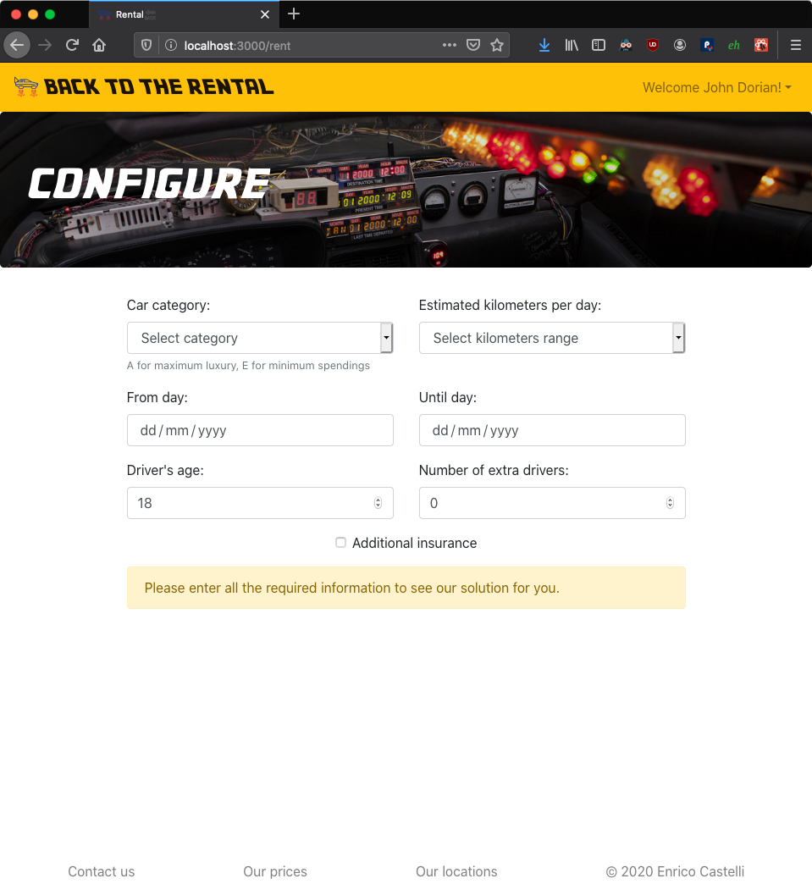

# Exam #1: "Car Rental"
 

## Student: s280124 Castelli Enrico 

## React client application routes

- Route `/`: home page with view of unique available cars; two filters allow to choose multiple brands and categories dynamically
- Route `/login`: login form
- Route `/logout`: redirects to home page after deleting the authentication cookie
- Route `/resetpassword`: demo, no mail server required in this project
- Route `/rent`: configurator form, dynamically displays the number of available cars for a period of time and a category, plus the price given a set of parameters; allows to proceed to payment once filled
- Route `/payment`: payment form, dynamically shows "Pay now" button once all details are entered
- Route `/rentals`: allows an authenticated user to see all their reservations, and to cancel the future reservations

## REST API server

- POST `/api/user/login`
  - request parameters: none
  - request body: `{email, password}`
  - response body: `{id, name, email}`
- POST `/api/user/logout`
  - request parameters: none
  - request body: none
  - response body: none
- GET `/api/cars/:carId`
  - request parameters: `carId`
  - request body: none
  - response body: one car object `{id, category, brand, model, optional[description, kilometers, year, fuel, value, kmperlitre, passengers, stickshift]}`
- GET `/api/cars`
  - request parameters: none
  - request body: none
  - response body: list of car objects `[{id, category, brand, model, optional[description, kilometers, year, fuel, value, kmperlitre, passengers, stickshift]}, ...]`
- GET `/api/user` (check if user is logged in)
  - request parameters: none
  - request body: none
  - response body: `{id, name, email}`
- POST `/api/rentals/:rentalId` (cancel rental)
  - request parameters: `rentalId`
  - request body: none
  - response body: none
- POST `/api/rentals`
  - request parameters: none
  - request body: `{startingDay, endDay, carCategory, driversAge, driversAgeSpecific, extraDrivers, extraDriversSpecific, estimatedKilometers, insurance, carId, userId, canceled, amount}`
  - response body: `{newId}`
- GET `/api/rentals/:userId`
  - request parameters: `userId`
  - request body: none
  - response body: list of rentals objects `[{id, startingDay, endDay, carCategory, driversAge, driversAgeSpecific, extraDrivers, extraDriversSpecific, estimatedKilometers, insurance, carId, userId}, ...]`
- GET `/api/rentals`
  - request parameters: none
  - request body: none
  - response body: list of rentals objects `[{id, startingDay, endDay, carCategory, driversAge, driversAgeSpecific, extraDrivers, extraDriversSpecific, estimatedKilometers, insurance, carId, userId}, ...]`
- POST `/api/payment`
  - request parameters: none
  - request body: `{"details": {fullName, cardNumber, CVV, amount}, "rental": {startingDay, endDay, carCategory, driversAge, extraDrivers, estimatedKilometers, insurance, userId}}`
  - response body: none

## Server database

- Table `CARS` - contains `id, category, brand, model, [description, kilometers, year, fuel, value, kmperlitre, passengers, stickshift]` where the fields between [] were initially added for future use, and:
  - `category` can be the strings "A", "B", "C", "D", "E"
  - `brand` is a string
  - `model` is a string
- Table `RENTALS` - contains `id, startingday, endday, carcategory, driversage, driversagespecific, extradrivers, extradriversspecific, estimatedkilometers, insurance, carid, userid, canceled, amount` where:
  - `startingday` and `endday` are strings for out-of-the-box compatibility with client-side library `moment.js`
  - `carcategory` can be the strings "A", "B", "C", "D", "E"
  - `driversage` is a tri-state integer (0, 1, 2) for under 25, between 25 and 65, over 65
  - `driversagespecific` is the integer age value
  - `extradrivers` is an integer boolean (0, 1)
  - `extradriversspecific` is the integer number of extra drivers
  - `estimatedkilometers` is a tri-state integer (0, 1, 2) for under 50, between 50 and 150, over 150
  - `insurance` is an integer boolean (0, 1)
  - `canceled` is an integer boolean (0, 1)
  - `amount` is a numeric value
- Table `USERS` - contains `id, email, name, hash`, where:
  - `email` is a string
  - `name` is an optional string
  - `hash` is the string corresponding to the user's password encrypted with `bcrypt`

## Main React Components

- `App` (in `App.js`): maintains cars and user-related state variables and manages routes
- `CarsList` (in `components/CarsList.js`): displays the list of available cars in the home page
- `Car` (in `components/carslist/Car.js`): displays information about a single car
- `LoginForm` (in `components/LoginForm.js`): displays the login form
- `ResetPasswordForm` (in `components/ResetPasswordForm.js`): displays a demo page
- `ConfiguratorForm` (in `components/ConfiguratorForm.js`): displays the rental configurator form
- `PaymentForm` (in `components/PaymentForm.js`): displays the payment form
- `RentalsList` (in `components/RentalsList.js`): manages the authenticated user's rentals state and separates them into the future, current, and past categories
- `RentalsTable` (in `components/rentalslist/RentalsTable.js`): displays the `RentalsList` data in a responsive table
- `Rental` (in `components/rentalslist/Rental.js`): displays a single row of `RentalTable`
- `Header` (in `components/Header.js`): displays the app header with contextual buttons
- `Footer` (in `components/Footer.js`): displays a demo app footer

## Screenshot

## Test users
Format: email, password (is frequent customer)  

* jd@sacredheart.com, ImNoSuperman (frequent customer)
* elliot.reid@gmail.com, blond3d0ctor
* chocolate.bear@yahoo.com, Izzie2008
* carla.espinoza@hotmail.com, dominican35
* percival.ulysses.cox@icloud.com, Jackie
* b.kelso@sacredheart.com, Johnny1942

## Known warnings
You may see in the console some warnings related to the `AutosizeInput` and `Select` components of the `react-select` library, used in the `CarsList` component, due to its use of some deprecated code. This has been tested to not impact the functionality of the web application in any tangible way.

When the authentication cookie gets deleted, either at user logout or at expiration time, a warning will be logged to the console. This has been ignored following a professor's reply on Slack.

A warning about `findDOMNode` deprecation in `StrictMode` may appear in the console when loading the website or when loading a user's rentals: this originates in the `react-bootstrap`'s `Modal` used to display dialogs in the `RentalsList` component, and has been tested to not cause any noticeable issues.

## Requirements
This project was tested on macOS 10.15 and Ubuntu 20.04 with Firefox 77. All features work correctly in Firefox, and it has been tested that some features don't work as expected in Chrome (e.g. required fields are not required by the browser) and Safari (e.g. not all images are correctly loaded). These issues have not been fixed since multi-platform compatibility was not explicitly required for this exam.

It is expected that the `nodemon` package is installed globally on the target machine (`npm i -g nodemon`), and it was not included in the dependencies section of the server's `package.json`.
